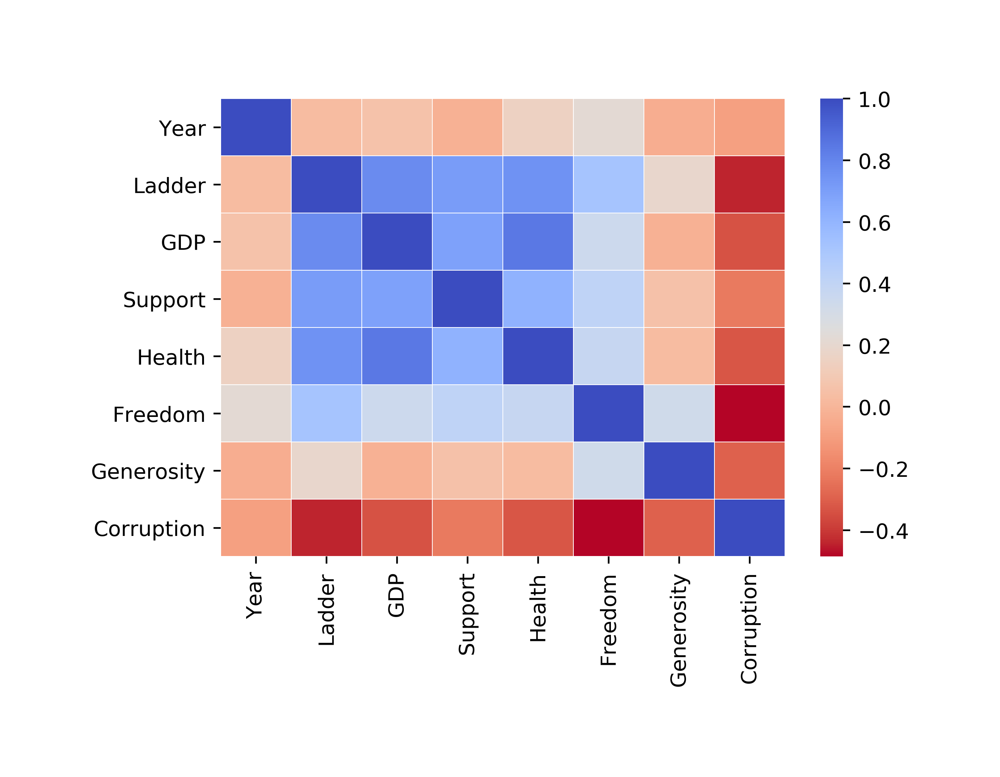
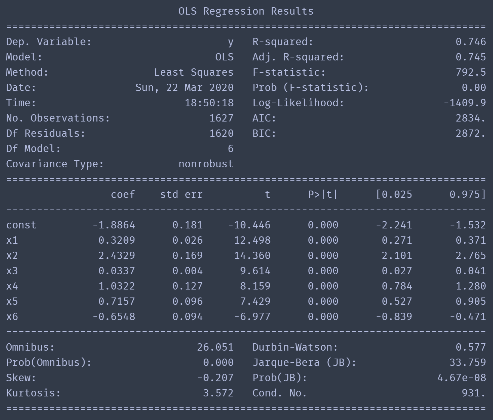
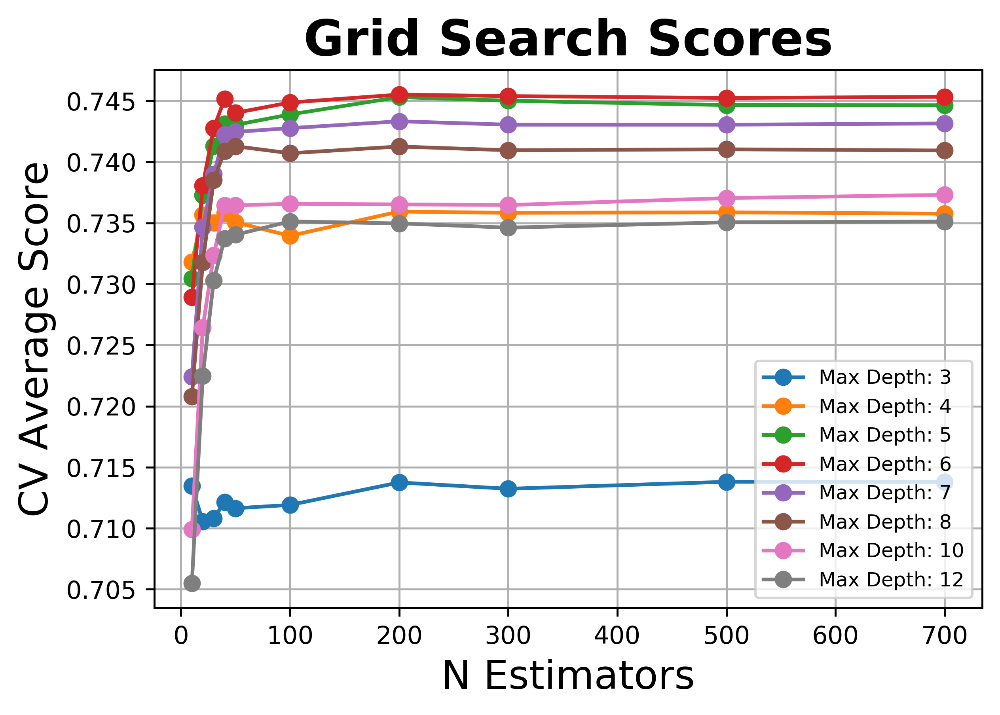
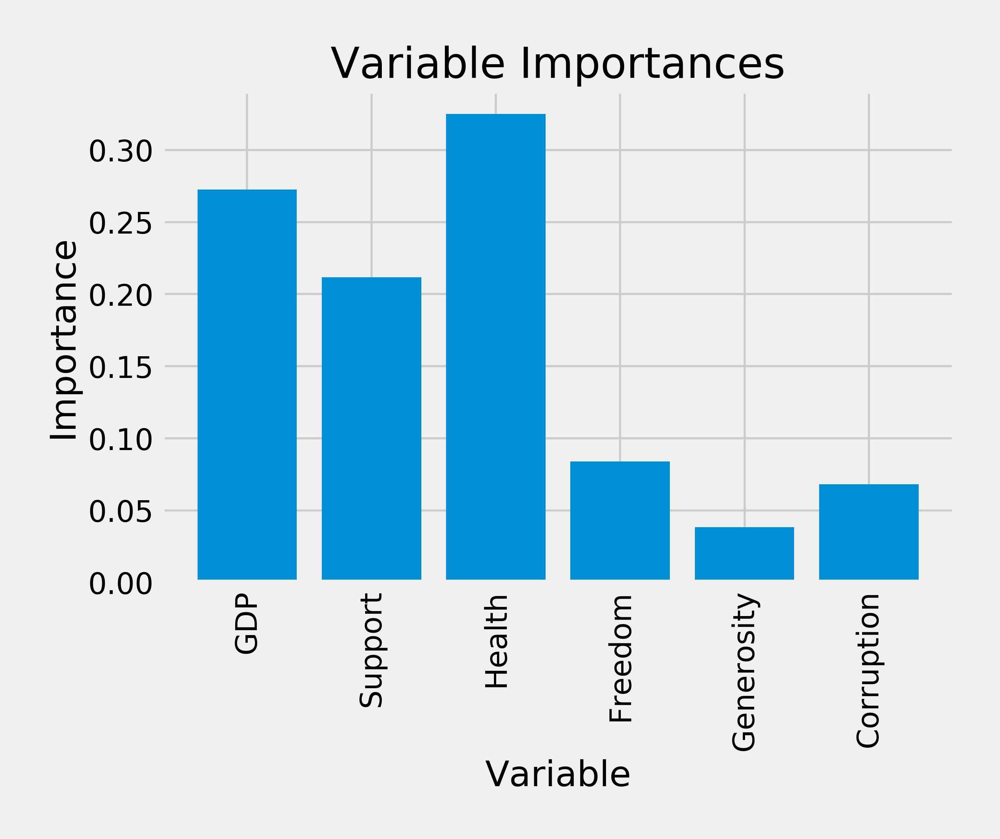
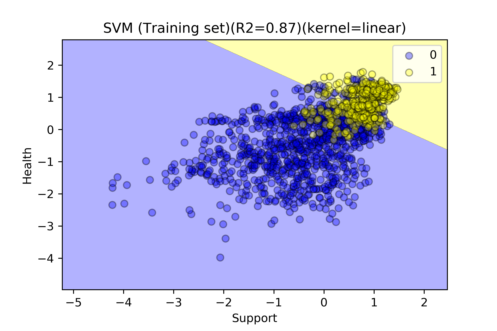
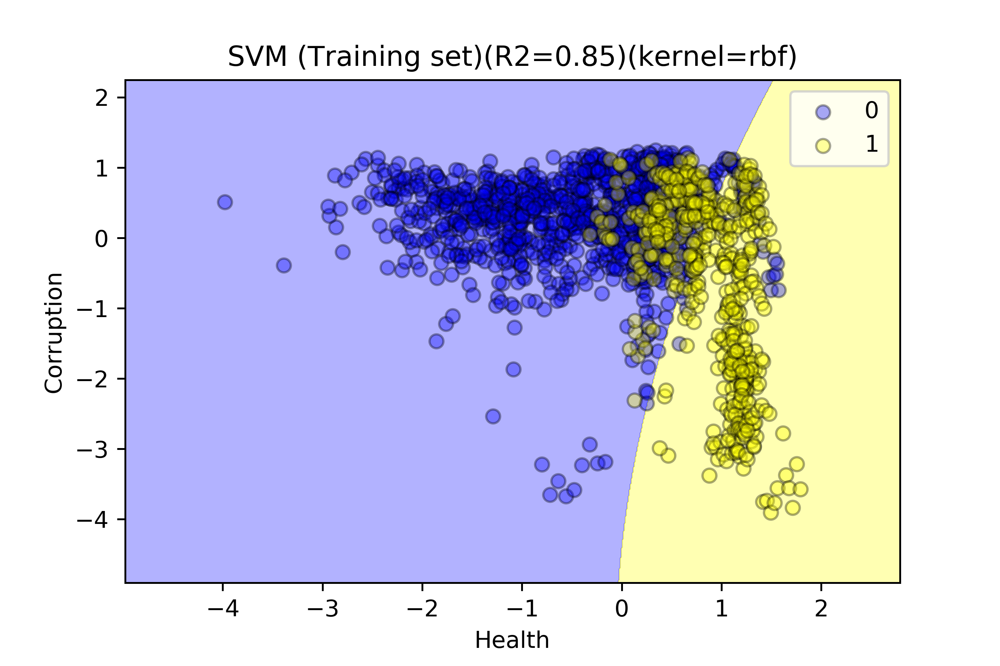

# **_A Look at World Happiness through Machine Learning_**

# Introduction  

# Data Source  

* [World Happiness Report](https://worldhappiness.report/)  

* Training Set: **_2005 - 2019_**  

* Test Set: **_2020_**  

# Data Prep  

* Unnecessary columns removed  

* Rows removed with empty cells  

* Target Variables  _(min, mean, max)_  

	- `Ladder Score`  _(2.375092,  5.445810,  8.018934)_  

* Features Variables  _(min, mean, max)_  

	- `GDP per capita`  _(6.456574,  9.244531,  11.728235)_  

	- `Social support`  _(0.290184,  0.290184,  0.987343)_  

	- `Healthy life expectancy at birth`  _(32.299999,  63.169525,  77.099998)_  

	- `Freedom to make life choices`  _(0.257534,  0.738467,  0.985178)_  

	- `Generosity`  _(-0.331775,  0.000109,  0.679921)_  

	- `Perceptions of corruption`  _(0.035198,  0.749064,  0.983276)_  

# Data Exploration  

## 2-D Relationships between each Feature and the Target variable (Ladder Score)  

  

## Feature Selection  

### Correlation Matrix  

  

* Strongest correlations with the target variable **Ladder** are **GDP**, **Support**, and **Health** (with **0.779501**, **0.710214**, and **0.750692**)  

* A bit weaker correlated w/**Ladder** are **Freedom**, **Generosity**, and **Corruption** (with **0.521902**, **0.190646** and **-0.441650**)  

* The highest correlation between features is between **GDP** and **Health** with **0.843902**  

* No features have a correlation greater than 0.9, so no features will be dropped based on the correlation matrix  
---

### Based on P-value  

  

* No p-values are greater than the significance level of 0.5  

* All features will be kept

## Feature Engineering  

### Visualizing all possible relationships between features in 2-dimensions  

* Made the Ladder score a Category by saying any value greater-than 6 is a 1 ("Happy"), and a 0 otherwise  

* Red dots are "Happy"  

  

# Multivariable Linear Regression  

## Feature Scaling

* Feature scaling wasn't required for sklearn's `LinearRegression` regressor  

## Results

* Using all the features in a linear regression we obtained a score of **_R2 = 0.745_** on the training set and a score of **_R2 = 0.736_** on the test set from the year 2020.  

# Random Forest Regression  

## Feature Scaling

* Feature scaling wasn't required for sklearn's `RandomForestRegressor` regressor.  

## Tuning Hyperparameters

* Using `GridSearchCV` the parameters varied were `n_estimators` and `max_depth`.  

* The plot below revealed that increasing `n_estimators` beyond a certain point did not improve accuracy, yieding diminishing returns. Similarly, increasing `max_depth` improved accuracy up to a certain point, then reduced it.  

  
 
* With a more thorough GridSearch, the best parameters found are in the table below; yielding scores of **_R2 = 0.911_** on the training set and **_R2 = 0.859_** on the test set from the year 2020.  

|   Hyperparameter   | Tuned Value |
|:-------------------|:-----------:|
| `n_estimators`     |     500     |
| `max_depth`        |      8      |
| `max_features`     |     sqrt    |
| `min_sample_leaf`  |      1      |
| `min_sample_split` |      2      |
| `bootstrap`        |     True    |

## Feature Importance  

* Seems on par with the correlation matrix, Health, GDP, and Support being the most impotant (Health is ranked the most important here)

# SVM  

* Should we include?  

* Does it add any value or insight?  

* I'm thinking NO  (aside from puurrdy plots)  
 

  

# Conclusions

* Health, GDP, and Support are rated the most important features in predicting the Ladder score with the Random Forest Regression model.  

* They are also found to correlate the strongest with Ladder in the correlation Matrix.

* Although GDP is highly ranked, if we were able to do a more thorough analysis of feature importance, I think we would find that it is more a "means to an end". That a human's deeper (or essential) sense of well-being is more tied to Health and social factors like Support/Family. Economy helps us get there by putting food on our tables, providing for our families and friends, and having access to better healthcare. Machine learning seems like an interesting tool to help us understand and dissect the complexities and hidden variables behind human emotions.  

# Contributors 

* __Claudia Palmer-Martinez:__ [github](https://github.com/Claud50623)  

* __Alexandra Solano:__ [github](https://github.com/alexsolano36)  

* __Donatienne Noel:__ [github](https://github.com/donatiennenoel)  

* __John S. Chapek:__ [github](https://github.com/code-sparrow)

